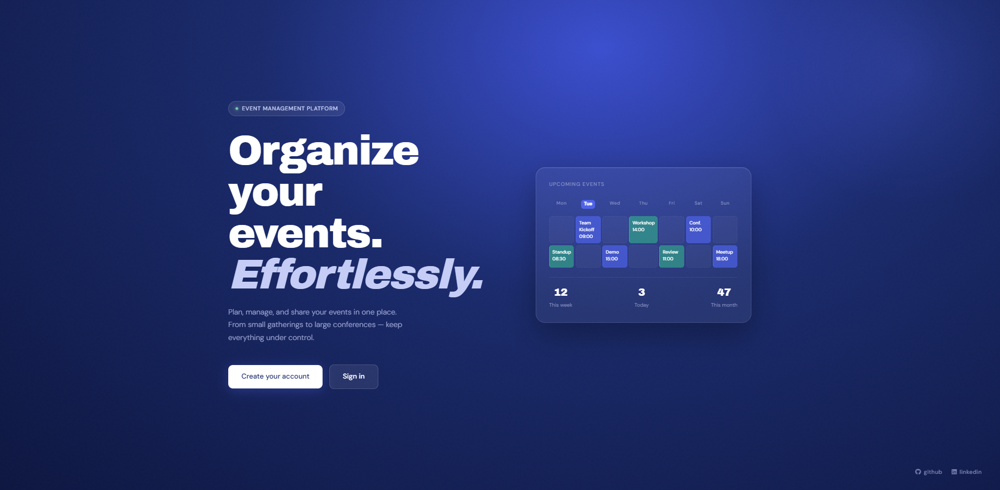

# Event Management

Uma aplicação web robusta desenvolvida em Django para facilitar a organização, edição e descoberta de eventos. O sistema foca em uma experiência de usuário limpa, utilizando uma interface baseada em "cards" e "ilhas" de edição totalmente responsivas.


## Funcionalidades

Autenticação e Segurança: Proteção de rotas sensíveis utilizando LoginRequiredMixin, garantindo que apenas usuários autenticados gerenciem conteúdos.

Dashboard Interativo: Interface principal com busca dinâmica e filtros para localização rápida de eventos.

UI Responsiva & Polida: Sistema de grid dinâmico com altura de cards padronizada e tratamento de overflow de texto, garantindo uma interface consistente independente do volume de dados.

Segurança e Permissões: Implementação de LoginRequiredMixin e verificações a nível de View para garantir que usuários só gerenciem seus próprios eventos, além de proteção contra ataques CSRF em todos os formulários.

Persistência de Dados Robusta: Integração total com PostgreSQL, garantindo a integridade dos dados, suporte a transações complexas e prontidão para escalabilidade em ambiente de produção.


## Tecnologias

Backend: Python 3 + Django Framework (Class-Based Views).

Frontend: HTML5, CSS3 (Flexbox/Grid) e integração com o motor de templates do Django.

Banco de Dados: PostgreSQL (Produção).

Controle de Versão: Git e GitHub.

Containerização: Docker + Docker Compose para ambiente de desenvolvimento reproduzível.


## Screenshots
 



## Como rodar localmente

### Com Docker (recomendado)

```bash
git clone https://github.com/NicolasRenck/event-management
cd event-management
```

Crie um arquivo `.env` na raiz com as variáveis:

```env
DB_NAME=eventdb
DB_USER=postgres
DB_PASSWORD=sua_senha
DB_HOST=db
DB_PORT=5432
```

Suba os containers:

```bash
docker-compose up --build
```

Acesse em: `http://localhost:8000`

---

### Sem Docker

```bash
git clone https://github.com/NicolasRenck/event-management
cd event-management
python -m venv venv
venv\Scripts\activate  # Windows
pip install -r requirements.txt
python manage.py migrate
python manage.py runserver
```